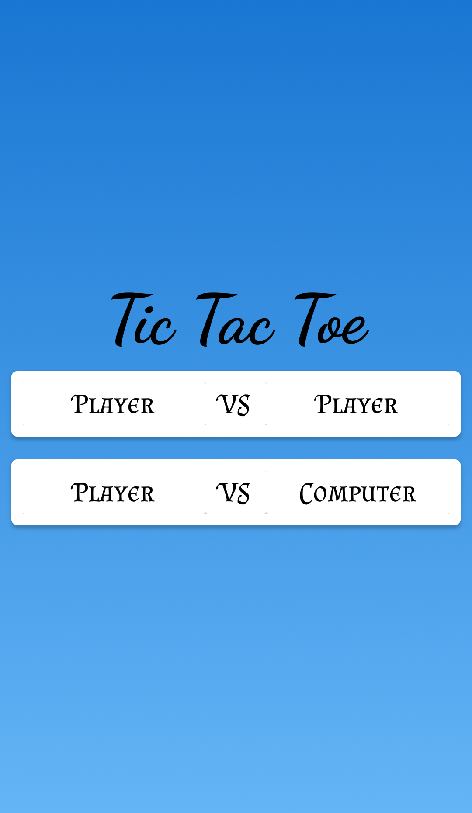
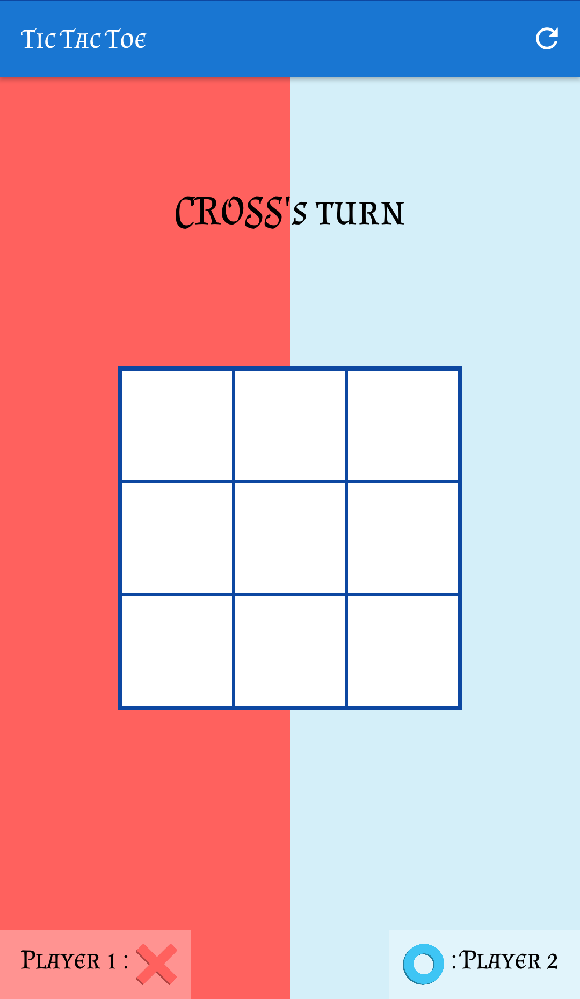
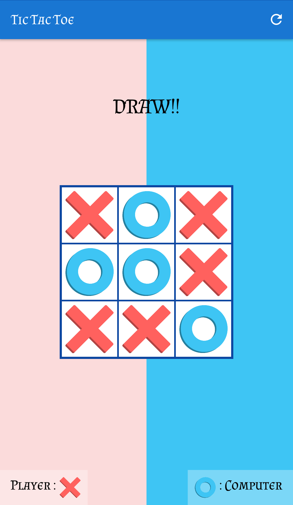
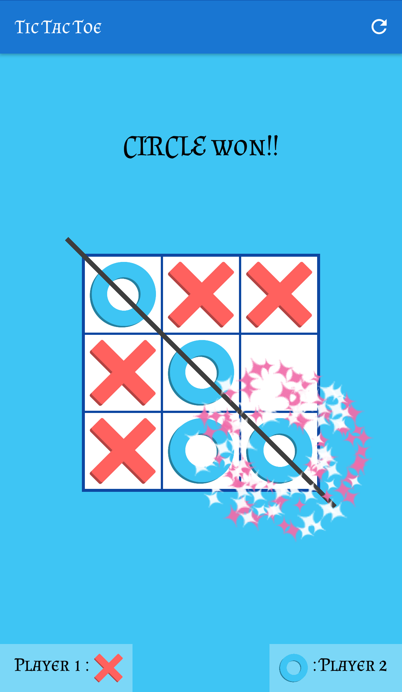
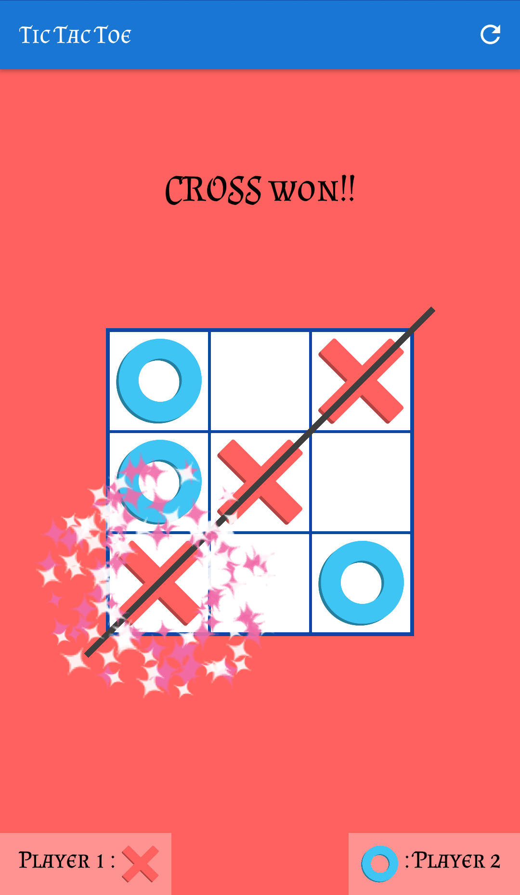

 

 
 
# TicTacToe
* This android app is a Tic Toc Toe Game.
* There are 2 modes for playing the game :
  *  Player vs Player
  *  Player vs Computer

## Screenshot of Activites
                

### Implementation of AI vs Player
* Selecting the Best Move for the AI
  * <a href="https://www.geeksforgeeks.org/minimax-algorithm-in-game-theory-set-3-tic-tac-toe-ai-finding-optimal-move/">MiniMax Algorithm</a>
  
### Credits
- <a href="https://github.com/plattysoft/Leonids">Plattysoft Leonids</a>  for stars Celebration

------------------------------------------------------------------
### To setup the project on your local machine:
1. Click on `Fork`.
2. Go to your fork and `clone` the project to your local machine.
3. `git clone https://github.com/isumit19/TicTacToe-App.git`
4. Run project on Android Studio.
